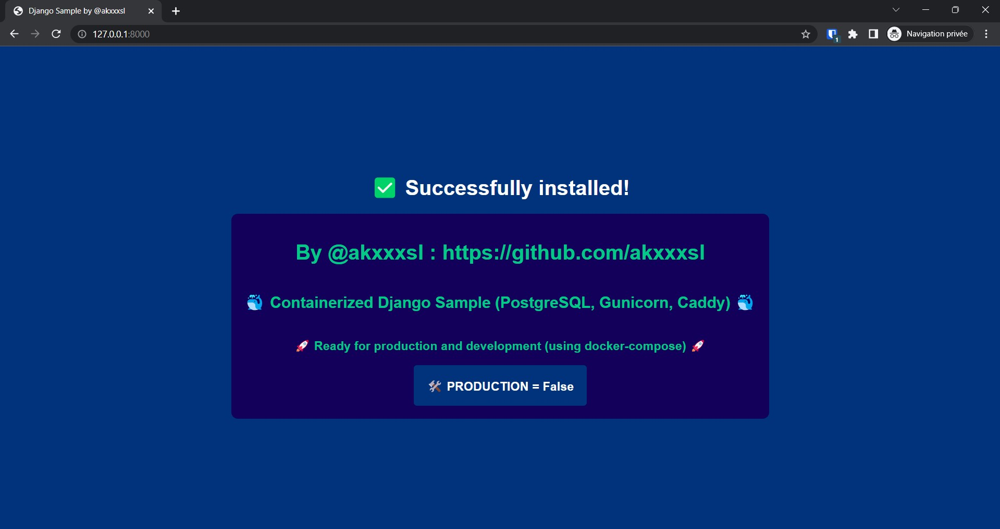

# 🐳 Containerized Django Sample (PostgreSQL, Gunicorn, Caddy) 🐳
## 🚀 _Ready for production and development (using docker-compose)_ 🚀

🏗️ Containerized architecture with PostgreSQL as the database, Gunicorn as the application server, and Caddy (reverse-proxy) for SSL management. 🏗️

### 🛠️ In development:

Use python manage.py runserver to start the server.
An SQLite database will be used during development.

### 🏢 In production:

> ⚠️ **Important:** It is crucial to have a domain pointing to your server's IP address, as well as the 'www' subdomain and change the SECRET_KEY in settings.py

Turn on PRODUCTION=True in settings.py and replace all this value by yours :
settings.py :
```sh
your_domain.com
YOUR_DB_NAME
YOUR_USER
YOUR_PASSWORD
YOUR_SMTP_HOSTING_PROVIDER
YOUR_EMAIL_FOR_SMTP
YOUR_EMAIL_PASSWORD
```

docker-compose.yml
```sh
YOUR_USER
YOUR_PASSWORD
YOUR_DB_NAME
```

Caddyfile :
```sh
your_domain.com
www.your_domain.com
```

🔧 Use the script ./manage [commands].
Allow script execution with chmod +x manage.sh.

🚦 First start of the production environment: ./manage first_start
- 🟢 To start the containers: ./manage start
- 🔴 To stop the containers: ./manage stop
- 🔁 To restart the containers: ./manage restart
- 🏗️ To build the containers: ./manage build
- 📜 To make migrations: ./manage makemigrations
- 🔍 And to apply migrations: ./manage migrate
- 👑 To create a superuser: ./manage createsuperuser
- ℹ️ Other commands are available using the command ./manage help.


### ✅ After a successful installation, you will be able to see this page:


